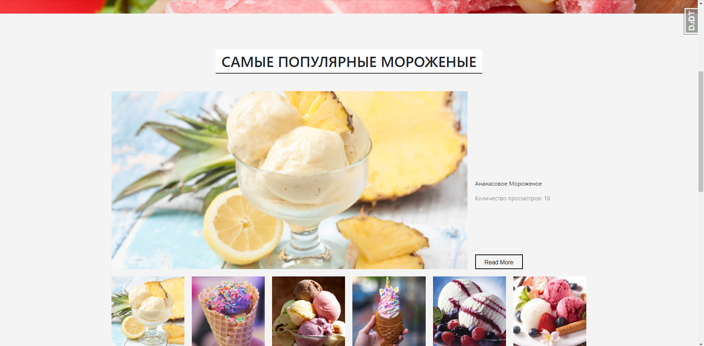
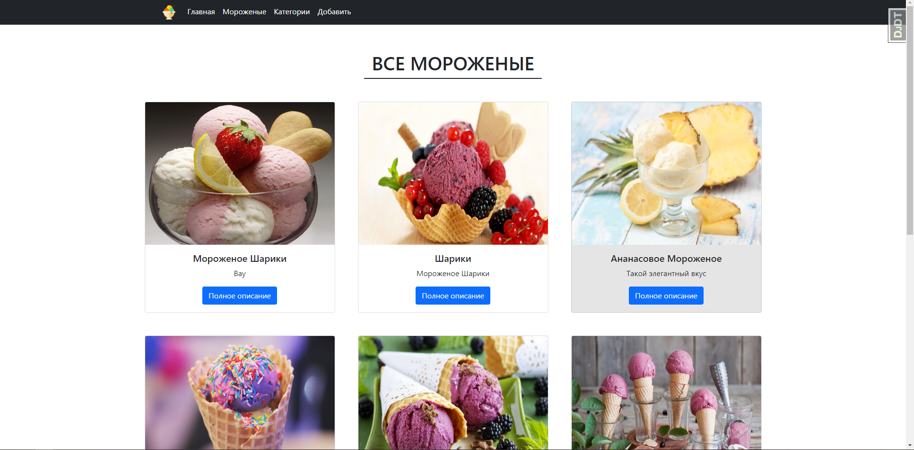
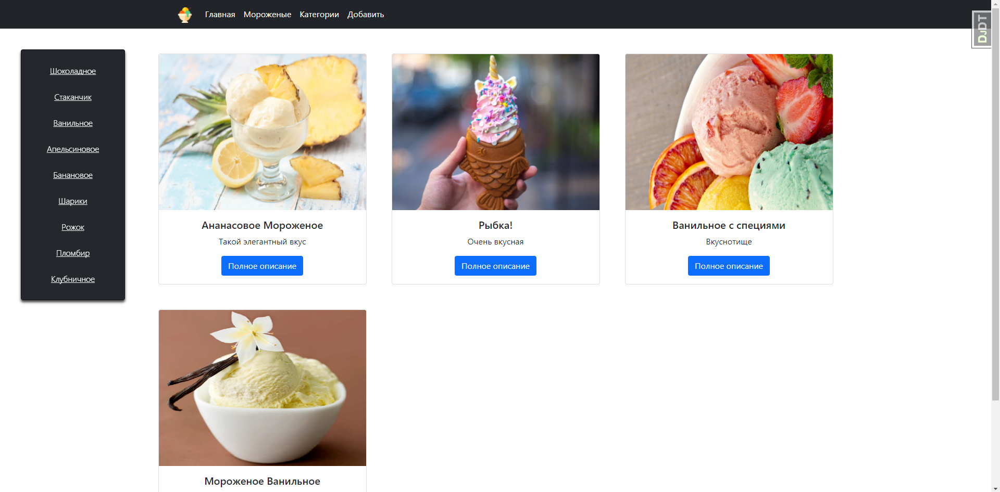

# Магазинчик с мороженым
### К примеру товаров оставил базу данных с некоторыми продуктами:




### В магазинчике есть: 
* Мороженые
* Система популярных и самых дорогих мороженых
* Карточки с пагинацией
* Сортировка по категориям 

### Для установки:

Использовался Python 3.10

##### Это для Windows:

* Создать виртуальную среду:

```
python -m venv venv
```

* Запустить виртуальную среду:

```
venv\Scripts\activate
```

* Скачать зависимости с requirements.txt:

```
pip install -r requirements.txt
```

* Создать файлик .env в корне проекта и в него положить некоторые переменные:

##### Обязательные: 

SECRET_KEY=

DEBUG_VALUE=

Для быстрого использования, секрет кей: 'django-insecure-p4hldk)!^n4(rrrzlz_^-c%!g$v9$a8e)7kobrlz6!qvtk#7gb'

Дебаг: True

##### Для базы данных postgreSQL:

DB_NAME=

DB_USER=

USER_PASSWORD=

DB_HOST=

DB_PORT=

* Запустить сервер:

```
python manage.py runserver
```

### Через Docker:

#### Добавить все переменные в docker-compose.yml

```
SECRET_KEY=
DEBUG_VALUE=
```

Для использования своей базы данных или например PostgreSQL нужно добавить данные переменные:

```
POSTGRES_DB=
POSTGRES_USER=
POSTGRES_PASSWORD=

DB_NAME=
DB_USER=
USER_PASSWORD=
DB_HOST=
DB_PORT=
```

### Запустить `docker-compose up` в директории проекта.
### И в конце, после запуска контейнера перейдите на http://localhost:8000/
